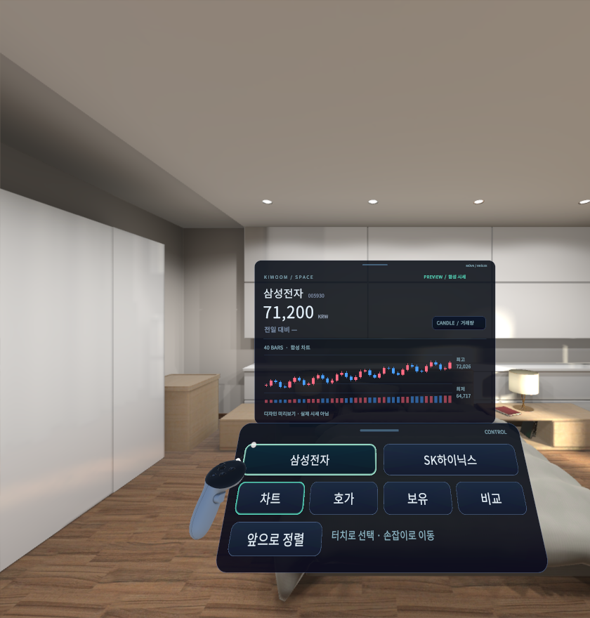

# Spatial Trading — Quest 3

A staged mixed-reality trading prototype. Interfaces produce typed actions; components consume application context and financial capabilities. Brokerage and Gemini secrets belong on the gateway.

**Current state:** Milestone 0 is documented and the original M1 shell is verified in Unity, an inspected Android build and Meta XR Simulator. The redesigned spatial UI, typed financial observations, gateway contract and local client/server connection are verified; M2 live integration remains in progress. **Live Kiwoom connectivity remains blocked by missing specification, and Quest 3 hardware acceptance remains pending.** No orders are submitted.

- [Roadmap and current gates](docs/ROADMAP.md)
- [Milestone 2 scope and verification](docs/MILESTONE_2.md)
- [Meta-guided design system](docs/DESIGN_SYSTEM.md)
- [Gateway setup](gateway/README.md)
- [Architecture](docs/ARCHITECTURE.md)
- [Interaction model](docs/INTERACTION_MODEL.md)
- [Action model](docs/ACTION_MODEL.md)
- [Financial models](docs/FINANCIAL_MODELS.md)
- [Order safety](docs/ORDER_SAFETY.md)
- [Kiwoom API mapping and specification blockers](docs/KIWOOM_API_MAPPING.md)
- [Failure model](docs/FAILURE_MODEL.md)
- [Milestone 1 evidence and acceptance](docs/MILESTONE_1.md)
- [Unity setup and build commands](docs/QUEST_SETUP.md)
- [Third-party notices](docs/THIRD_PARTY_NOTICES.md)

`quest/` is the Unity project. `scripts/` contains reproducible validation/build entry points. `tests/Domain/` compiles the exact pure C# sources and tests used by Unity under .NET, without substituting for Unity or headset validation.

The shell has an explicit, static synthetic catalog and chart. Position data is unavailable. The gateway currently reports missing-specification status; live quotes, account connection, voice/Gemini integration and order execution are not yet enabled.

The image records the current Focus surface. The room is a simulator environment. All displayed prices and candles are synthetic fixtures. This is not a capture of live market data or a physical Quest session.

When the gateway cannot provide data, the same surface shows unavailable values and the specification blocker; it never activates preview automatically. [Gateway-state capture](docs/images/milestone2-gateway.png).

The authoritative Kiwoom workbook stays local and is excluded from Git because its examples contain credential-shaped values. Before broker implementation on another machine, obtain the authorized specification and verify the source hash recorded in [API mapping](docs/KIWOOM_API_MAPPING.md). Missing or ambiguous specification remains `BLOCKED_BY_MISSING_SPEC`.
