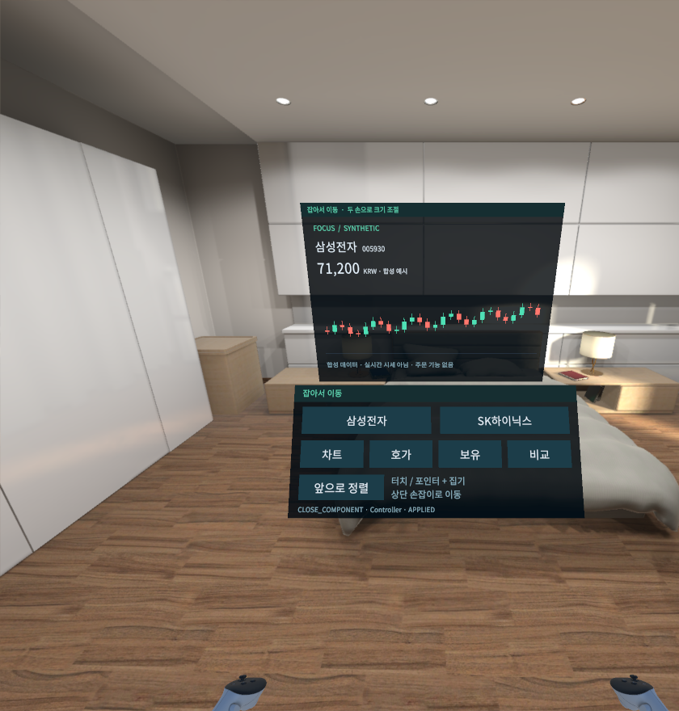

# Spatial Trading — Quest 3

A staged mixed-reality trading prototype. Interfaces produce typed actions; components consume application context and financial capabilities. Brokerage and Gemini secrets belong on the future gateway.

**Current state:** Milestone 0 architecture is documented. Milestone 1 compiles in the pinned Unity editor and passes 23 Unity EditMode tests. Meta XR Simulator controller interactions are verified. An ARM64 IL2CPP Android APK is built and inspected; **Quest 3 hardware acceptance remains pending**. This checkout does not submit orders or connect to financial services.

- [Architecture](docs/ARCHITECTURE.md)
- [Interaction model](docs/INTERACTION_MODEL.md)
- [Action model](docs/ACTION_MODEL.md)
- [Financial models](docs/FINANCIAL_MODELS.md)
- [Order safety](docs/ORDER_SAFETY.md)
- [Kiwoom API mapping and specification blockers](docs/KIWOOM_API_MAPPING.md)
- [Failure model](docs/FAILURE_MODEL.md)
- [Milestone 1 evidence and acceptance](docs/MILESTONE_1.md)
- [Unity setup and build commands](docs/QUEST_SETUP.md)
- [Third-party notices](docs/THIRD_PARTY_NOTICES.md)

`quest/` is the Unity project. `scripts/` contains reproducible validation/build entry points. `tests/Domain/` compiles the exact pure C# sources and tests used by Unity under .NET, without substituting for Unity or headset validation.

The shell has an explicit, static synthetic catalog and chart. Position data is unavailable. There is no gateway, live quote, account connection, voice/Gemini integration, or order execution in Milestone 1.

The room is a simulator environment. All displayed prices and candles are synthetic fixtures. This is not a capture of live market data or a physical Quest session.

The authoritative Kiwoom workbook stays local and is excluded from Git because its examples contain credential-shaped values. Before broker implementation on another machine, obtain the authorized specification and verify the source hash recorded in [API mapping](docs/KIWOOM_API_MAPPING.md). Missing or ambiguous specification remains `BLOCKED_BY_MISSING_SPEC`.
