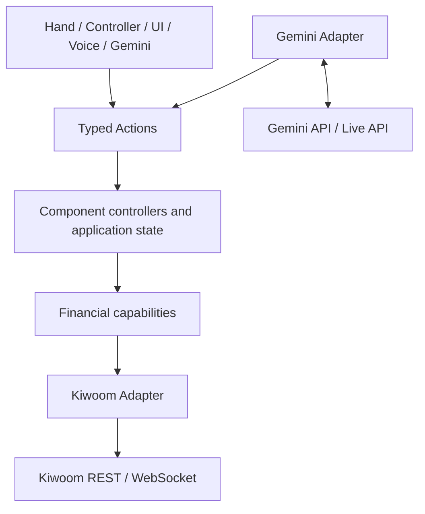
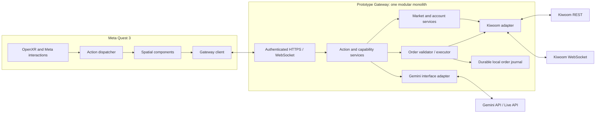

# Spatial trading architecture

Milestone: **0 — architecture only**. Baseline: 2026-09-17.

This document defines the implementation boundaries and milestone gates for a seated Meta Quest 3 mixed-reality application. No Unity project, gateway, API integration or order submission is implemented at this milestone. No credentials were read or used. The repository initially contained only the API workbook. It was not a Git checkout at inspection time.

## Document contract

| Document | Owns |
| --- | --- |
| [INTERACTION_MODEL.md](INTERACTION_MODEL.md) | Spatial components, input behavior, Focus/Workspace/Trade modes, device acceptance |
| [ACTION_MODEL.md](ACTION_MODEL.md) | Typed actions, dispatch, interface provenance, Gemini tool allowlist |
| [FINANCIAL_MODELS.md](FINANCIAL_MODELS.md) | Financial capability contracts, data quality, units and identity |
| [ORDER_SAFETY.md](ORDER_SAFETY.md) | Draft/confirmation/execution state machine, deterministic safety gates |
| [KIWOOM_API_MAPPING.md](KIWOOM_API_MAPPING.md) | Repository-only brokerage evidence, exact fields and integration blockers |
| [FAILURE_MODEL.md](FAILURE_MODEL.md) | Failure behavior, recovery, observability and test matrix |

These are proposed application contracts, not claims about Kiwoom wire semantics. Only the API mapping may define Kiwoom URLs, API IDs, fields or state interpretations. `BLOCKED_BY_MISSING_SPEC` means stop the affected integration until an authoritative specification is added to this repository. It does not prevent unrelated shell or architecture work.

## Architecture and dependency direction



The component layer includes the Order application controller. It owns the draft/review lifecycle; its visual surface is a replaceable view. A renderer failure cannot become an order executor or silently cancel a submitted order.



The order fast path is `physical confirmation → CONFIRM_ORDER → Order controller → OrderValidator → OrderExecutor → Kiwoom Adapter → REST`. Gemini, rendering, workspace persistence, analytics, and remote logging are absent from this dependency chain. Mandatory authentication, deterministic validation, concurrency control and durable submission intent are part of correctness, not optional analytics.

## Module boundaries

| Module | Responsibility | Must not own |
| --- | --- | --- |
| Quest Domain / Actions | C# typed contracts, action dispatch, selection and component bindings | Brokerage fields, API keys, authoritative balances |
| Quest Interfaces | Meta hand/controller callbacks, UI controls, microphone capture, action adaptation | Separate per-interface business rules |
| Quest Components | Selector, chart, order book, position, compare and structured order views | Kiwoom parsing, execution policy |
| Quest Infrastructure | Gateway HTTPS/WS client, cancellation, reconnect, Unity main-thread delivery | Direct Kiwoom/Gemini credentials |
| Gateway Application | Shared action validation, session revisions, financial capability orchestration | SDK-specific gestures |
| Gateway Orders | Draft store, physical-confirmation authorization, validation, submission, reconciliation | LLM calls, workspace writes |
| Gateway Kiwoom | Token management, verified account binding, REST/WS codecs, source normalization | User interaction, inferred order intent |
| Gateway Gemini | Approved tools, bounded audio/visual context, provider timeouts and cancellation | Broker executor reference, confirmation permission, financial calculations |
| Gateway Infrastructure | Secure configuration, local journal, task lifecycle, redacted event export | Financial decision rules |

Use Python, FastAPI, Pydantic and async networking for the gateway. Start with one process and one execution owner. Use a transactional SQLite journal on durable local storage before enabling orders. Do not deploy multiple submitter workers or replicas until ownership/fencing is designed and verified. Market and Gemini work must have bounded queues and separate concurrency budgets so they cannot exhaust order admission resources. Never wait for a global event bus subscriber to execute an order.

Future source layout, to create only in the relevant milestone:

```text
quest/Assets/SpatialTrading/{Domain,Actions,Interfaces,Components,Infrastructure}
quest/Packages/manifest.json
quest/ProjectSettings/ProjectVersion.txt
gateway/app/{application,models,orders,capabilities,adapters,transport,infrastructure}
gateway/tests/{contracts,financial,orders,failures}
contracts/                      # versioned application schemas and safe fixtures
docs/                           # architecture and source mapping
```

## Quest baseline

Use Unity C#, the OpenXR loader, Meta XR Core and Meta Interaction SDK, with one coherent camera/input rig. Select and lock the exact Unity editor, Android toolchain and package versions in Milestone 1 after a compatibility check and a device build. Do not claim a version matrix has been tested at Milestone 0. Pin both manifest and resolved dependencies; commit Unity `.meta` files with their assets. Keep Unity XR implementation types outside financial/domain assemblies.

Meta documents standardized poke, ray and grab interactions and both hand/controller support. Its passthrough tutorial covers the MR setup. These are the implementation starting points, not evidence that this project runs on-device: [Meta hand tracking](https://developers.meta.com/horizon/documentation/unity/unity-handtracking-overview/), [Interaction rig](https://developers.meta.com/horizon/documentation/unity/unity-isdk-cameraless-rig/), [Passthrough setup](https://developers.meta.com/horizon/documentation/unity/unity-passthrough-tutorial/). Unity documents its [OpenXR Meta package](https://docs.unity3d.com/kr/6000.0/Manual/com.unity.xr.meta-openxr.html). Sources checked 2026-09-17.

Quest 3 has no eye-tracking interaction in this design. Head orientation is placement context only and is never labeled eye gaze. Camera passthrough rendering is not permission to capture the room for AI.

## State, data and transport

Shared UI context is restricted to `SelectedInstrument`, `SelectedAccount` (opaque alias), `ComparisonInstrument`, `CurrentMode` and a context revision. Selection is not financial truth. Components hold disposable, time-stamped capability results; they independently request data for their bindings. The gateway owns drafts, orders and account authorization. Workspace layout is local presentation state only.

The Quest dispatcher handles local view/state actions and forwards financial mutations to the gateway. Gemini produces the same action contracts through a gateway session action channel. Quest acknowledges context revisions; stale voice turns cannot overwrite a newer manual selection. Financial mutations always revalidate server-side. See [ACTION_MODEL.md](ACTION_MODEL.md) for dispatch rules.

HTTPS is used for action requests, capability snapshots and order operations. WebSocket is used for normalized capability events, action proposals and optional audio streaming. The confirmation request uses HTTPS and does not depend on the market-data socket. Versioned application envelopes include correlation, request/subscription identity, data revision and gateway connection epoch. These are our fields, never invented broker headers.

Subscription identity includes principal, account alias where applicable, instrument, venue, capability and parameters. Deduplicate matching market subscriptions using reference counts; an individual component closing must not unsubscribe another component. Cancel obsolete reads and reject late results by binding revision. Use a bounded latest-value market queue; an overflow marks a gap and forces resynchronization. Order events are persisted/reconciled and never handled by the lossy market queue.

On reconnect, authenticate again, fetch current context/drafts/orders, invalidate old challenges, recreate subscriptions, then refresh snapshots. Never replay queued confirmation or submission requests. Historical charts and saved layout may be restored with explicit source/age labels; restored values are never live merely because the UI loaded them.

## Gemini as an interface

The gateway holds the Gemini key and manages all provider connections, including Live sessions. Quest sends user-initiated audio and explicitly selected application visual context. The initial tool set is exactly `select_instrument`, `open_chart`, `open_orderbook`, `open_position`, `compare_instrument`, `create_order_draft`. No generic HTTP, brokerage, shell, account-switch or execution tool is exposed.

The adapter validates each tool name and payload, applies session and origin constraints, dispatches the corresponding normal Action, then returns the application's actual result. Tool text cannot directly call capabilities. Disable automatic tool execution; explicitly handle provider tool responses. Google describes application function calling and Live tool response handling in [Function calling](https://ai.google.dev/gemini-api/docs/function-calling) and [Live tools](https://ai.google.dev/gemini-api/docs/live-api/tools). Exact SDK/model selection is deferred to Milestone 5; a model name in documentation is not a pinned dependency.

Multimodal explanation receives an app-rendered chart crop, instrument/period identity, and an optional allowlisted structured public-data snapshot with timestamps. Account surfaces, identifiers and room imagery are excluded initially. Private account explanation requires a separately designed consent/data policy. AI output is labeled explanatory, carries context age, and cannot mutate structured financial values. Images, retrieved text and tool output are untrusted inputs; apparent instructions in them never expand tool permissions. No voice transcript or frame retention by default.

## Security and operation

Use HTTPS/WSS with normal certificate validation, including development on a private network. Bootstrap Quest access through an operator-controlled pairing flow; give the device short-lived, scoped gateway sessions. Broker and Gemini credentials remain in secure gateway configuration. An authenticated device is authorized for explicitly configured account aliases only. Validate authorization on every HTTP request, subscription, context update and order operation. The root `.gitignore` excludes environment files, a secrets directory and credential/account text-file patterns; examples must contain placeholders only. Ignore rules do not sanitize files or revoke credentials.

Bind each account alias to a server-side credential slot and the account verified for its token. Raw account identifiers remain server-side and must not appear in source control, fixtures, telemetry or AI context. Recheck binding after token refresh. Separate simulation and live configurations and data namespaces; never fall back from one to the other. Default real trading and voice trading to disabled. Keep secrets, local journal files, private config, Unity caches/builds and microphone/camera captures outside version control when the implementation is scaffolded.

Untrusted Gemini transport has no access to the physical-confirmation ingress. Interface labels are audit metadata, not authentication. [ORDER_SAFETY.md](ORDER_SAFETY.md) defines the physical confirmation trust boundary and its limitation on compromised devices.

## Incremental delivery gates

Each milestone finishes with its own evidence. A later milestone is not implicitly implemented by this document.

| Milestone | Deliverable and exit evidence |
| --- | --- |
| 0 — Architecture | Seven linked contracts, repository-only mapping with exact source cells, explicit blockers, state/flow review. No production code or live calls. |
| 1 — Quest shell | Reproducible Quest Android build, passthrough, hands/controller fallback, Focus Mode, poke/ray/pinch/grab/move/resize on actual Quest 3. Use clearly labeled synthetic shell content only. No Kiwoom networking. |
| 2 — Market data | Resolve relevant mapping blockers first; auth and lookup/quote/candle/book parsing tests; verified REST and WS lifecycle. Prove selected-instrument propagation, race rejection and freshness on chart/book. |
| 3 — Account | Verified token-account binding and alias authorization, complete paginated positions/balance, no missing-as-zero. Prove chart/book/position coherence and account switching isolation. |
| 4 — Actions/components | Complete typed action dispatch and Workspace Mode. Contract fixtures prove hand/controller/UI equivalence; add/remove/move/resize and bindings are independent. |
| 5 — Gemini voice | Approved tools only, Korean utterance tests, ambiguity/timeout/malformed-call rejection, manual controls continue with Gemini down. No confirmation tool. |
| 6 — Multimodal | Explicit app context selection, visible capture state, bounded provider data, explanatory output cannot replace structured data. |
| 7 — Order draft | Validators, immutable revisions, Trade Mode, voice toggle, value/account/product gates, physical confirmation UI tests. Submission adapter disabled. |
| 8 — Real execution | All order-spec blockers resolved; durable at-most-one local attempt, reconciliation, authorization and fault tests pass. Then an operator-led smallest practical live order with explicit per-order physical confirmation and authoritative status evidence. |
| 9 — Hardening | Fault matrix in FAILURE_MODEL passes, including restart/duplicate/unknown scenarios; actual device comfort and performance results recorded separately. |

Although full action architecture is Milestone 4, Milestone 1 inputs use the minimal typed action seam already specified here; do not first embed business logic in MonoBehaviour callbacks and then duplicate it. Likewise, draft fault tests run before the first live order, even though broader hardening is Milestone 9.

The next implementation increment is Milestone 1. Kiwoom integration currently has blocking specification gaps listed in [KIWOOM_API_MAPPING.md](KIWOOM_API_MAPPING.md); completing this architecture does not close those gates. A request to build the eventual prototype is not permission for an unattended live financial transaction.

## Milestone 0 verification record

On 2026-09-17, a read-only OOXML extraction and document consistency check verified all seven required documents, local links, table column structure, 49 explicitly prefixed workbook source references, 17 REST mappings (API name/ID/path, required body inputs and cited field names), and all ten order-book levels against source cells. The workbook SHA-256 remained unchanged. This verifies transcription and document structure only. No Unity build, headset test, gateway test, authentication, WebSocket session or financial transaction was performed. The detailed implementation gates remain open.
