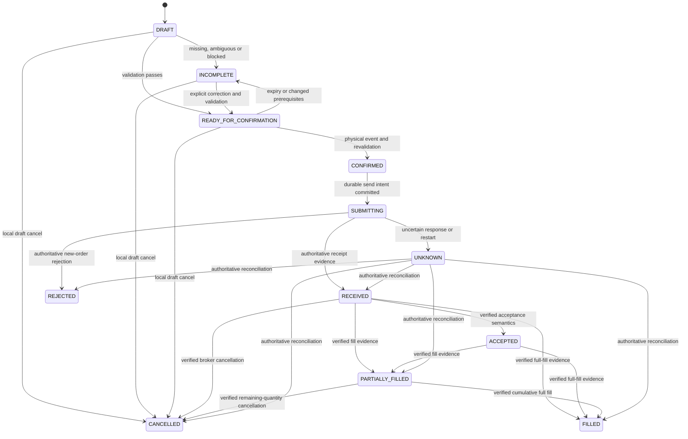

# Order safety and deterministic execution

Status: Milestone 0 specification. **Real submission is disabled and blocked by unresolved Kiwoom specifications.** Nothing in this document authorizes an unattended live trade.

## Invariants

1. Every real order originates as a versioned, structured draft and passes deterministic validation.
2. Voice/Gemini can create an allowed draft; neither can confirm or submit it. Manual operation remains independent of Gemini availability.
3. Confirmation binds the exact account, instrument, side, quantity, type, price applicability, venue, currency and environment reviewed by the user. No silent corrections or substitutions.
4. The gateway owns voice policy, value limits, whitelists, authorization, state and concurrency checks. UI controls and prompts are not enforcement.
5. Exactly one local submission attempt may cross the send boundary for a draft execution. A transport retry is not safe evidence of non-submission. There is no claim of end-to-end exactly-once delivery to the broker.
6. Submission response and execution are distinct. Uncertain outcomes remain UNKNOWN; never automatically retry or infer FILLED.
7. Broker/account observations come from structured Kiwoom data. LLM, OCR, audio interpretation and cached UI values cannot establish account capacity, price bounds or execution state.

## Server policy and safe defaults

| Configuration | Default / behavior |
| --- | --- |
| `REAL_TRADING_ENABLED` | `false`; no live submission when false |
| `VOICE_TRADING_ENABLED` | `false`; reject creation of real drafts originating from voice, including voice through Gemini |
| `MAX_REAL_ORDER_VALUE` | `0` KRW (live trading disabled); must be explicitly configured to a positive exact amount before enabling submission |
| `ACCOUNT_WHITELIST` | Empty; references secure server account bindings, never account IDs in committed files |
| `PRODUCT_WHITELIST` | Only verified `KOREAN_CASH_EQUITY`; unknown classification rejected |
| `INSTRUMENT_WHITELIST` | Empty for initial live rollout; explicitly provision a small verified instrument set |
| `ALLOWED_ORDER_TYPES` | Empty until mapping/safety gates pass; smallest target is ordinary KRX cash LIMIT BUY/SELL, then MARKET only after a deterministic bound is established |
| Draft/challenge/validation expiry and data age limits | Explicit positive server durations required before live enablement; missing/invalid values disable confirmation |

These are application policies, not Kiwoom fields. Config load fails closed for malformed limits, unknown products or inconsistent live/mock settings. No “unlimited” fallback. A policy revision change invalidates outstanding review challenges and requires revalidation/review. Disabling voice trading invalidates unsubmitted voice-originated drafts; it does not cancel an order already sent. Disabling real trading prevents new sends, while status reconciliation continues.

Exclude margin, credit, short selling, derivatives, overseas products, complex/conditional/time-in-force variants, SOR and NXT routing in the initial executable slice. Do not infer cash-only eligibility from an order API name or a stock-looking code. Sell quantity must be within verified cash tradable holdings. Buy funding must be verified cash capacity including required charges; deposit balance alone is not that proof.

## Draft validation

`OrderDraftValidator` runs on the gateway for every manual or AI-created intent:

1. Authenticate principal and resolve the selected allowed account alias to a verified token-account binding. Reject missing/mismatched context revisions and explicit account ambiguity.
2. Preserve origin. If real voice origin and voice trading is disabled, reject the draft creation without creating an executable artifact.
3. Resolve instrument uniquely through the capability. Require explicit side, strictly positive integer quantity and a supported order type. Missing fields produce `INCOMPLETE` with field-level reasons; unsupported policy/spec produces a blocking reason.
4. LIMIT requires a positive exact price. MARKET requires no limit price; a supplied conflicting price is ambiguity, not a field to discard. Never default side, quantity, type, account or instrument. Do not round quantity/price to a valid value.
5. Validate product/venue, sourced lot/tick/session rules, account whitelist, cash-only capacity, tradable quantity and deterministic order-value bound. Missing authoritative input keeps the draft incomplete/ineligible.
6. Create an immutable revision with deterministic review data, validation evidence, expiry and policy revision. Only eligible complete drafts become `READY_FOR_CONFIRMATION`.

Changing any material field creates a new draft revision, invalidates every challenge and clears prior confirmation. Global account/instrument changes during review require explicit cancellation or re-creation; they never retarget the existing draft. Client-provided estimates, capability snapshots and validation flags are not trusted. A ready draft is not permission to submit later without revalidation.

## Maximum value and market-order constraint

`MAX_REAL_ORDER_VALUE` is a hard ceiling on gross execution notional per order, in KRW, for both BUY and SELL. Fees/taxes are separately considered for account capacity; an estimate is never a bound. Compare exact decimals and reject overflow. Equal to the limit is allowed only if every other gate passes; one KRW above is rejected.

For a LIMIT BUY, quantity × limit price is a candidate upper bound only once the broker's ordinary-limit execution semantics and tick rules are documented. A LIMIT SELL price is a lower price constraint, so quantity × limit is not a ceiling on possible proceeds. MARKET in either direction also lacks a price ceiling from its intent alone. These cases require an authoritative, applicable execution-price upper bound for the instrument/session and verified semantics. A displayed quote, best ask, last trade, statistical slippage allowance or visible order-book depth does not provide this guarantee.

The workbook lists upper-price and order-type fields but does not establish all rules needed to prove this bound. Therefore MARKET execution, and any other order whose bound is unproven, is `BLOCKED_BY_MISSING_SPEC`. The requested voice MARKET draft can be displayed as incomplete/blocked when voice trading is enabled, but Demo F cannot be claimed complete. Do not silently convert it to LIMIT. The staged support target does not waive any requirement for eventual MARKET support.

Use an account-scoped admission lock and one in-flight execution per account initially. Include locally reserved cash/quantity for unresolved submissions in eligibility; never release reservations merely because a request timed out. Reconcile authoritative outstanding orders and externally changed holdings. Local controls cannot prevent trading through another client; Kiwoom remains the final authority and may reject on a race.

## Physical confirmation trust boundary

The paired Quest physical interaction adapter alone can request/use confirmation challenges. Generic actions, Gemini sessions and audio channels cannot acquire confirmation authority. Gate the dedicated confirmation service with device-session scope and a draft-owned review challenge; the action enum `HAND` or `CONTROLLER` alone has no power.

Challenges are unpredictable, short-lived, single-use and bound to principal, device session, connection epoch, draft ID/revision, canonical review digest and policy revision. They carry no ability to change draft fields. The structured surface uses the same canonical review snapshot the server hashes. Client acknowledgments record that the required fields were rendered; they do not replace validation. A deliberate near hand hold or controller hold, as specified in [INTERACTION_MODEL.md](INTERACTION_MODEL.md), completes the physical event.

Define the digest as SHA-256 over a versioned canonical UTF-8 serialization of the material intent, account/instrument identity, environment, displayed estimate/bound and their calculation basis, draft revision, review expiry and policy revision. Use a fixed field order, exact normalized decimal strings and explicit null applicability; never hash locale-formatted UI text. Continuously changing age counters and receipt IDs are recorded as evidence separately rather than changing the digest every frame. If confirmation-time validation changes a displayed amount, material field, bound/basis, expiry or policy, invalidate the challenge and render a new review before another physical confirmation. Newer evidence may validate the same reviewed values, but cannot silently rewrite them.

On `CONFIRM_ORDER`, reject VOICE/GEMINI/UI ingress regardless of any supplied source label, unknown/expired/consumed challenges, digest/revision mismatch, session ownership mismatch and non-ready state. The server rechecks policy/data after any await. A replay returns the existing submission/order status without creating another attempt. Reusing an action/event ID with altered content is an error.

A standard Quest app does not cryptographically prove that a human performed a gesture. This design trusts the paired application and its restricted interaction code. Device/session compromise is outside that guarantee and must be addressed before a deployment requiring stronger assurance. Do not call a nonce or `isPhysical=true` hardware attestation. Test ordinary remote/model/source-spoofing and replay paths explicitly; those must fail closed.

## State machine

Use `phase=DRAFT|ORDER` to distinguish local cancellation from a broker outcome. Application states are not Kiwoom state names.

The diagram describes allowed conceptual outcomes, not mandatory intermediary steps. Direct authoritative full-fill evidence can arrive before an HTTP receipt; do not invent intermediate events. Any post-send state whose current outcome becomes uncertain gains an UNKNOWN current-status overlay while preserving its known observations and filled quantity. An unknown status never erases an already confirmed fill.

| State | Evidence / behavior |
| --- | --- |
| `DRAFT` | Intent stored; no send possible |
| `INCOMPLETE` | Missing/ambiguous field or blocking policy/spec/data reason; confirm disabled |
| `READY_FOR_CONFIRMATION` | Complete validated revision within validity window, awaiting physical action |
| `CONFIRMED` | Valid physical confirmation recorded with revalidated immutable intent; not a broker acknowledgment |
| `SUBMITTING` | Durable send intent claimed; a send may have occurred; must not be retried automatically |
| `RECEIVED` | Verified broker receipt; current mapping allows only documented, correlated receipt evidence |
| `ACCEPTED` | Reserved for verified broker acceptance semantics; currently unmapped, never inferred from HTTP success |
| `REJECTED` | Authoritative rejection of this new order; local preflight failure stays incomplete, and a rejected cancel does not mean the original order was rejected |
| `PARTIALLY_FILLED` / `FILLED` | Verified order-scoped execution and cumulative/remaining quantities under sourced semantics; currently incomplete mapping |
| `CANCELLED` | In DRAFT phase: local draft cancellation. In ORDER phase: authoritative broker cancellation, preserving any fills. No initial broker-cancel action. |
| `UNKNOWN` | May have been submitted or has insufficient/conflicting execution evidence. Show status investigation; no retry control. |

`CONFIRMED` and `SUBMITTING` intent records are committed in one short local transaction immediately before send, so no confirmed work queue survives to auto-execute later. A failure before that transaction leaves no send and requires a fresh challenge/review. After it, even a crash just before network write is conservatively uncertain. Broker transitions remain gated by [KIWOOM_API_MAPPING.md](KIWOOM_API_MAPPING.md); a state label in the application is not permission to invent a translation.

## Confirmed-order fast path

1. Authenticate the restricted ingress and resolve the stored review/draft. Verify challenge, source, owner, revision and intent hash.
2. `OrderValidator` obtains/rechecks required authoritative capacity/eligibility evidence within its validity policy. No LLM, image processing, workspace or analytics calls. If necessary financial reads fail or expire, stop before send and return the draft to incomplete.
3. Under the account admission lock, recheck state, challenge, policy and freshness. Atomically consume the challenge, reserve capacity and create a unique durable `SubmissionAttempt`, recording confirmation and send intent. Unique constraints cover draft execution identity and confirmation ID. Competing confirm/cancel requests have one winning transition.
4. Release database transaction locks before network I/O but retain execution ownership. `OrderExecutor` invokes the Kiwoom Adapter exactly once. Disable generic HTTP retries, redirects and mutation retry middleware for order submission. Do not refresh a token and replay an already attempted order.
5. Validate the response and persist its safe structured observation. Associate any broker order reference with account, environment, venue and date. Broker response success alone never maps to FILLED. If persistence fails after send, retain UNKNOWN and reconcile.
6. Return the known result; publish UI and redacted telemetry asynchronously. Client timeout/disconnect cannot cancel/retry the server submission task. Orders already admitted have an application-owned bounded lifecycle separate from the HTTP request lifetime.

The local transactional journal is required to prevent duplicate execution across restart; it is not optional log export. If it is unavailable/full/unwritable, reject new confirmation before sending. Optional remote telemetry may fail without blocking execution. Do not add Kafka, a workflow engine or nonessential services to this path.

## Unknown outcomes and restart

The submitter never resends a SUBMITTING/UNKNOWN attempt. On gateway restart, fence execution ownership, load unresolved journal records, mark uncertain attempts UNKNOWN and invalidate all review challenges. Previously ready drafts require fresh validation and a new physical review. Do not execute persisted CONFIRMED work automatically.

Reconciliation uses only verified Kiwoom account order/fill queries and events. A known broker order number is matched together with account, date, environment and material fields. With a lost response and no broker reference, several identical orders can exist; matching instrument/side/quantity/time is not sufficient proof. Preserve ambiguity and require authoritative resolution. A “not found” query, empty unfilled list or changed balance is not proof of non-submission.

The workbook does not establish complete recovery guarantees or broker idempotency. No speculative idempotency header is sent. Freeze new submissions for an account with unresolved exposure until reconciliation resolves it. The user may use the brokerage's own application/operator channel to investigate, but an assertion of failure is not automatic permission to resubmit through this app.

## Required tests before any real submission

| Area | Required outcome |
| --- | --- |
| Intent/schema | Missing side/account/instrument/type/quantity, fractional/boolean/negative/overflow quantity, invalid currency/price and unsupported types never reach executor |
| Voice provenance | Default false blocks voice-created real drafts; Gemini voice metadata cannot be relabeled; subsequent physical confirmation does not erase voice origin |
| Hard policies | Empty/changed whitelist, unsupported credit/product/venue, disabled real trading, exact limit boundary, insufficient cash/tradable quantity, unbounded MARKET all fail closed |
| Physical confirmation | Fake source label, UI/voice/Gemini path, expired/foreign/replayed challenge, modified digest, tracking loss, mode/input switch and stale revision create zero submissions |
| Concurrency | Duplicate presses from two devices, concurrent confirm/cancel, retries with different action IDs, and multiple drafts sharing scarce capacity create at most one eligible admitted attempt |
| Crash injection | Before transaction: no send. After intent commit/before send, during send, after broker receipt/before response, after response/before journal update: no automatic resend and correct unknown recovery |
| Semantics | HTTP success not FILLED; partial events not double-counted; cancellation/rejection scoped to correct order; REST and WS disagreement remains unknown |
| Isolation | Gemini outage, hung workspace save, broken chart, exhausted market queue and failed remote telemetry do not enter or stall an otherwise eligible manual execution path |
| Security | Cross-account/session access, credential/log leaks, raw account IDs in client data, environment mismatch and unverified token binding are rejected |

Run these with a recording fake adapter and source-shaped fixtures, then verified integration/sandbox tests when their specs permit. Record counts of actual `submit_order` calls, not just final state assertions. These tests are specified here, not executed at Milestone 0. The first small live test requires a user-reviewed draft and physical confirmation for that specific real order; keep its evidence separate from simulation.
